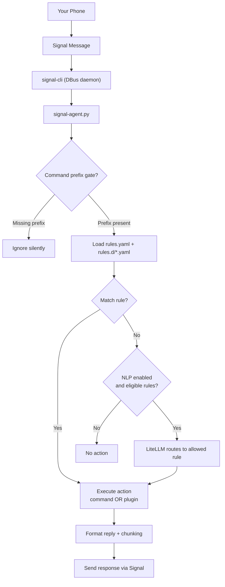

# Signal CLI Agent

Signal CLI Agent is a **rule-driven automation engine** that connects to `signal-cli` via DBus and executes **local actions** in response to **trusted** Signal messages.

It lets you securely trigger actions on a host using Signal as the control channel — without exposing SSH, a web server, or a public API.

**Rule schema / config reference (authoritative):**  
👉 **[docs/RULES.md](docs/RULES.md)**

**Plugin reference (authoritative):**  
👉 **[docs/PLUGINS.md](docs/PLUGINS.md)**

**External REST API (optional outbound sends):**  
👉 **[docs/REST_API.md](docs/REST_API.md)**

**Optional “less strict” prompts via LiteLLM (NLP routing):**  
👉 **[docs/NLP.md](docs/NLP.md)**

---

## Table of Contents

- [Overview](#overview)
- [Why Use This?](#why-use-this)
- [Architecture](#architecture)
- [Command Prefix Gate](#command-prefix-gate)
- [Plugins](#plugins)
- [External REST API](#external-rest-api)
- [NLP Routing (LiteLLM)](#nlp-routing-litellm)
- [Installation](#installation)
  - [Prerequisites](#prerequisites)
  - [Quick Start (Recommended)](#quick-start-recommended)
  - [Boot-Time Startup (Optional)](#boot-time-startup-optional)
- [Writing Rules](#writing-rules)
- [Operating Modes](#operating-modes)
  - [Service Mode (Recommended)](#service-mode-recommended)
  - [Manual Mode](#manual-mode)
  - [Test Mode](#test-mode)
- [Maintenance](#maintenance)
  - [Uninstall Services](#uninstall-services)
  - [Remove Generated Files](#remove-generated-files)
- [FAQ](#faq)
- [Roadmap](#roadmap)
- [Security Notes](#security-notes)

---

## Overview

Signal CLI Agent:

- Listens for Signal messages (via `signal-cli` DBus daemon)
- Loads configuration from YAML
- Matches messages against sender + trigger conditions
- Executes an action (**command** or **plugin**)
- Sends results back via Signal

Rules are defined in YAML files and can be extended without modifying the agent code.

---

## Why Use This?

Instead of exposing:

- SSH access
- a web server
- a public API

…you can use Signal as a secure, authenticated automation interface.

Common use cases:

- System diagnostics (“disk?”, “uptime?”)
- Log inspection (“tail journal 50”)
- Service health checks
- Lightweight automation for trusted contacts
- API reads/writes (Home Assistant / monitoring / internal tools)

---

## Architecture



---

## Command Prefix Gate

To prevent accidental triggers (especially with NLP enabled), you can require a prefix on **all commands**.

Set this in `rules.yaml` under `globals`:

```yaml
globals:
  command_prefix: "!"
  command_prefix_strip_whitespace: true
```

Then users must send:

```
! bedroom on
! can you turn on the bedroom lights?
```

The prefix is stripped **before** rule matching and **before** NLP routing.

---

## Plugins

In addition to `command`-based rules, the agent supports **plugin-style rules** for structured integrations (HTTP reads, Home Assistant, etc.).

Why plugins?

- Avoid shelling out to helper scripts for common “API read/write” workflows
- Standardize request handling (timeouts, errors, formatting)
- Constrain behavior for safety (vs arbitrary shell)

### Example: read-only Home Assistant sensor query (plugin)

```yaml
- name: ha_temp
  sender: ["+15551234567"]
  trigger: "temp?"
  match: exact

  type: home_assistant
  home_assistant:
    action: get_state
    entity_id: sensor.example_temperature
    label: "Temperature"

  reply_mode: output
```

### Example: state change — activate a Home Assistant scene (plugin)

```yaml
- name: bedroom_on
  sender: ["+15551234567"]
  trigger: "bedroom on"
  match: exact

  type: home_assistant_service
  home_assistant_service:
    domain: scene
    service: turn_on
    entity_id: scene.bedroom_on
    label: "Bedroom"

  reply_mode: output
```

**Important:** The full plugin schema, supported actions, and recommended safety defaults are documented in:  
👉 **[docs/PLUGINS.md](docs/PLUGINS.md)**

---

## External REST API

The agent can optionally expose a **local REST API** for sending outbound Signal messages.

This is useful for:

- CI/CD notifications
- monitoring alerts
- home lab / internal tooling

Security controls include:

- Bearer token auth (token loaded from a local file)
- Destination allowlist (`allowed_destinations`)
- Optional client IP allowlist
- Size limits + rate limiting

See: **[docs/REST_API.md](docs/REST_API.md)**

---

## NLP Routing (LiteLLM)

Optionally, the agent can use a local **LiteLLM proxy** to route free-form text to a **pre-approved rule** when no rule matches normally.

This preserves the safety model:

- Only rules explicitly marked `nlp.enabled: true` are eligible
- The model can only choose from `globals.nlp.allowed_rules`
- Sender allowlists and rate limits still apply

See: **[docs/NLP.md](docs/NLP.md)**

### Minimum wiring (common gotchas)

To enable NLP routing you need **all three**:

1) `globals.nlp.enabled: true` in `rules.yaml`
2) Include rule names in `globals.nlp.allowed_rules`
3) Mark each eligible rule with `nlp.enabled: true` (and optionally `phrases:`)

---

## Installation

### Prerequisites

#### Install `signal-cli`

Official repository:  
https://github.com/AsamK/signal-cli

Official install docs:  
https://github.com/AsamK/signal-cli#installation

You must **register and verify** your Signal number with `signal-cli` before the agent can be used.

#### Install Python dependencies

```sh
pip install pydbus pyyaml
sudo apt install python3-gi
```

Requirements:

- Python 3.10+
- `pydbus`
- `PyYAML`
- `python3-gi` (GLib bindings)

---

### Quick Start (Recommended)

From the repository root:

```sh
make quickstart
```

This will:

1) Run `configure.py`  
2) Render configuration templates into your environment  
3) Install systemd **user** services  
4) Start both services (DBus daemon + agent)

Verify:

```sh
make status
make logs
```

---

### Boot-Time Startup (Optional)

Systemd **user** services normally start when you log in.

To allow them to start at boot and keep running after logout:

```sh
sudo loginctl enable-linger <your-username>
```

Check:

```sh
loginctl show-user <your-username> | grep Linger
```

---

## Writing Rules

### Where rules live

**Production rules** live in:

```text
rules.d/
```

You may add your own `.yaml` files there at any time.

### Templates vs production rules

This repo also ships **templates**, which get rendered into real files by `configure.py`:

- Shipped templates live under:
  ```text
  templates/
  ```
- Rendered outputs go into:
  ```text
  systemd/
  rules.d/
  ```

**Important behavior:**

- `configure.py` renders only the **shipped templates** under `templates/`
- Your own custom rule files placed in `rules.d/` are treated as **user-owned** and are not deleted by project tooling

For full schema, match modes, sender allowlists, safe patterns, reply formatting, and plugins:

👉 **[docs/RULES.md](docs/RULES.md)**

---

## Operating Modes

### Service Mode (Recommended)

One-command setup:

```sh
make quickstart
```

Common operations:

```sh
make status
make logs
make restart
make stop
```

---

### Manual Mode

Start the DBus daemon (session bus):

```sh
signal-cli -a +15551234567 daemon --dbus
```

Run the agent:

```sh
python3 signal-agent.py ./rules.yaml
```

---

### Test Mode

Simulate a message locally (no DBus, no Signal send):

```sh
python3 signal-agent.py ./rules.yaml \
  --test \
  --sender "+15551234567" \
  --message "! disk?"
```

Note: if you enable `globals.command_prefix`, your test message must include the prefix.

---

## Maintenance

### Uninstall Services

```sh
make uninstall
```

Removes installed systemd **user** units only.

### Remove Generated Files

```sh
make clean
```

Removes generated configuration and rendered shipped templates only.

Your custom rules in `rules.d/` remain untouched.

---

## FAQ

### Do I need to restart after editing rules?
No. Rules are automatically reloaded when files change.

### Can I allow multiple senders?
Yes. Use `sender:` as a list. See **[docs/RULES.md](docs/RULES.md)**.

### What if multiple rules match?
The agent executes the **first matching rule** and stops.

### Where should I store secrets (tokens, API keys)?
Do **not** commit secrets. Store them in protected files (e.g., `~/.config/...`) with `chmod 600`.

### Why are `signal-cli` logs so noisy?
`signal-cli` logs many message-related events (typing, receipts, sync metadata).  
For “what actually executed,” rely on the **agent logs** (`signal-agent.service`) which reflect rule evaluation and execution.

---

## Roadmap

Proposed ideas:

- Expand plugins (read-only GET first, then guarded POST actions)
- Docker deployment option
- Role-based access control / authorization tiers
- Metrics and enhanced logging

---

## Security Notes

This system executes local actions triggered by Signal messages.

You should:

- Restrict allowed senders
- Prefer strict matching (`exact`) when possible
- Validate inputs carefully (especially regex capture groups)
- Use rate limiting
- Avoid committing secrets
- Run as a non-root user

For detailed configuration, safety guidance, and safe vs unsafe examples:

👉 **[docs/RULES.md](docs/RULES.md)**