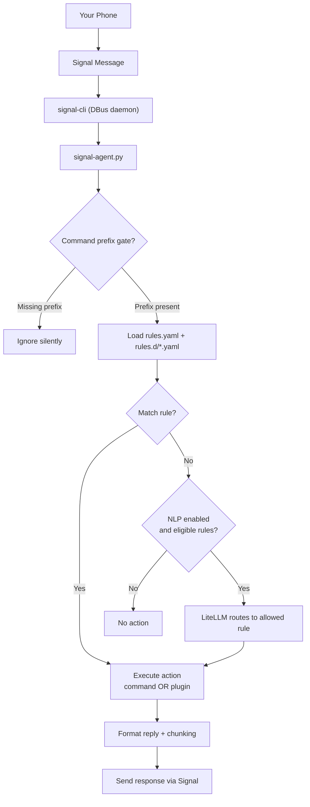

# Signal CLI Agent

Signal CLI Agent is a **rule-driven automation engine** that connects to `signal-cli` via DBus and executes **local actions** in response to **trusted** Signal messages.

It lets you securely trigger actions on a host using Signal as the control channel — without exposing SSH, a web server, or a public API.

**Rule schema / config reference (authoritative):**  
👉 **[docs/RULES.md](docs/RULES.md)**

**Plugin reference (authoritative):**  
👉 **[docs/PLUGINS.md](docs/PLUGINS.md)**

**External REST API (optional outbound sends):**  
👉 **[docs/REST_API.md](docs/REST_API.md)**

**Optional NLP routing (LiteLLM integration):**  
👉 **[docs/NLP.md](docs/NLP.md)**

**Non-container (systemd / bare-metal) operation:**  
👉 **[docs/NON_CONTAINER.md](docs/NON_CONTAINER.md)**

---

# Docker Setup (Recommended)

This repo is **container-first**: it runs **signal-cli + signal-cli-agent inside one container** with an **internal session D-Bus**.

The primary provisioning flow is **manual device linking** (scan an ASCII QR code printed in the terminal).

Full guide: **[docs/DOCKER.md](docs/DOCKER.md)**

---

# Quick Start (Using Makefile — Recommended)

From the repo root:

```bash
mkdir -p config data
```

### 1️⃣ Generate configuration

```bash
make docker-configure PHONE=+1XXXXXXXXXX
```

### 2️⃣ Link device (scan QR code)

```bash
make docker-link
```

When you run the link command, an ASCII QR code will be printed in your terminal.

To link this container to an existing Signal account:

1. Open **Signal** on your primary mobile device.
2. Go to **Settings → Linked Devices**.
3. Tap **Link New Device**.
4. Scan the QR code displayed in the terminal.
5. Wait for confirmation that the device has been successfully linked.

### 3️⃣ (Recommended) Sync once

```bash
make docker-sync
```

### 4️⃣ Start the stack

```bash
make docker-up
make docker-logs
```

---

# What the Make Commands Actually Do

For users who prefer raw Docker commands, here is what the Makefile wraps:

| Make Command | Equivalent Docker Command |
|--------------|--------------------------|
| `make docker-configure PHONE=+1XXX` | `docker compose -f docker/compose/docker-compose.yml run --rm --build signal-agent python3 /app/configure.py --mode container --config-dir /config --phone +1XXX` |
| `make docker-link` | `docker compose -f docker/compose/docker-compose.yml run --rm --build signal-agent link` |
| `make docker-sync` | `docker compose -f docker/compose/docker-compose.yml run --rm --build signal-agent sync` |
| `make docker-up` | `docker compose -f docker/compose/docker-compose.yml up -d` |
| `make docker-down` | `docker compose -f docker/compose/docker-compose.yml down` |
| `make docker-logs` | `docker logs -f signal-agent` |

The Makefile exists purely for convenience — it does not add additional orchestration logic.

---

# Configuration Layout

In Docker mode, the container expects:

- `./config/rules.yaml` → mounted to `/config/rules.yaml`
- `./config/rules.d/*.yaml` → mounted to `/config/rules.d/*.yaml`
- `./data/signal-cli` → mounted to `/data/signal-cli` (Signal device state)

The agent hot-reloads rules when files change.

---

# Architecture (High Level)



---

# Command Prefix Gate

To prevent accidental triggers (especially with NLP enabled), you can require a prefix on **all commands**.

Set this in `config/rules.yaml` under `globals`:

```yaml
globals:
  command_prefix: "!"
  command_prefix_strip_whitespace: true
```

Then users must send:

```
! bedroom on
! can you turn on the bedroom lights?
```

The prefix is stripped **before** rule matching and **before** NLP routing.

---

# Plugins

In addition to `command`-based rules, the agent supports structured plugin-style rules.

Full documentation: **[docs/PLUGINS.md](docs/PLUGINS.md)**

---

## Core Command Rule (Built-in)

The default rule type executes local shell commands.

Capabilities:

- Regex capture groups
- Input substitution
- Output formatting
- Rate limiting
- Sender restrictions

⚠️ Because this executes local commands, restrict senders and validate inputs carefully.

---

## HTTP Plugin

Performs outbound HTTP requests and returns structured responses.

Typical use cases:

- Query internal APIs
- Trigger webhooks
- Check system health endpoints
- Fetch JSON and extract specific fields

Features:

- GET / POST / other methods
- Custom headers
- Query parameters
- JSON parsing and filtering
- Controlled response formatting

---

## Home Assistant Plugin

Integrates with a Home Assistant instance via its REST API.

Typical use cases:

- Turn lights on/off
- Toggle switches
- Query entity state
- Trigger automations

Features:

- Long-lived access token authentication
- Direct service calls
- Entity state inspection
- Structured response formatting

---

## NLP Routing (LiteLLM Integration)

The agent supports optional **NLP-based rule routing** using LiteLLM.

This allows more natural language input instead of strict command matching.

Example:

Instead of:

```
! bedroom on
```

A user could say:

```
! can you turn on the bedroom lights?
```

How it works:

1. Strict rule matching is attempted first.
2. If no rule matches, and NLP is enabled:
   - The message is sent to LiteLLM.
   - The model selects from explicitly allowed rules.
   - The selected rule is executed.
3. The result is returned via Signal.

Important safeguards:

- NLP does not create new commands.
- It can only select from rules you explicitly mark as NLP-eligible.
- Command prefix gating still applies (recommended).

Configuration and setup instructions:

👉 **[docs/NLP.md](docs/NLP.md)**

---

# Security Notes

This system executes local actions triggered by Signal messages. You should:

- Restrict allowed senders
- Prefer strict matching (`exact`) when possible
- Validate inputs carefully (especially regex capture groups)
- Use rate limiting
- Avoid committing secrets
- Run as a non-root user where feasible

For detailed configuration, safety guidance, and safe vs unsafe examples:

👉 **[docs/RULES.md](docs/RULES.md)**