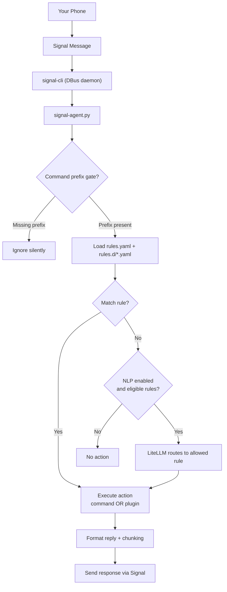

# Signal CLI Agent

Signal CLI Agent is a **rule-driven automation engine** that connects to `signal-cli` via DBus and executes **local actions** in response to **trusted** Signal messages.

It lets you securely trigger actions on a host using Signal as the control channel — without exposing SSH, a web server, or a public API.

**Rule schema / config reference (authoritative):**  
👉 **[docs/RULES.md](docs/RULES.md)**

**Plugin reference (authoritative):**  
👉 **[docs/PLUGINS.md](docs/PLUGINS.md)**

**External REST API (optional outbound sends):**  
👉 **[docs/REST_API.md](docs/REST_API.md)**

**Optional “less strict” prompts via LiteLLM (NLP routing):**  
👉 **[docs/NLP.md](docs/NLP.md)**

**Non-container (systemd / bare-metal) operation:**  
👉 **[docs/NON_CONTAINER.md](docs/NON_CONTAINER.md)**

---

## Docker setup

This repo is **container-first**: it runs **signal-cli + signal-cli-agent inside one container** with an **internal session D-Bus** (no host DBus socket mapping).

The primary provisioning flow is **manual device linking** (scan an ASCII QR code printed in the terminal).

Full guide: **[docs/DOCKER.md](docs/DOCKER.md)**

### Quick start

From the repo root:

```bash
mkdir -p config data
```

Generate `config/rules.yaml` and `config/rules.d/*`:

**Option A (recommended): run configure inside the container** (no host Python required)

```bash
# Replace with your real number (E.164)
docker compose -f docker/compose/docker-compose.yml run --rm --build signal-agent   python3 /app/configure.py --mode container --config-dir /config --phone +1XXXXXXXXXX
```

**Option B: run configure on the host**

```bash
python3 ./configure.py --mode container --config-dir ./config --phone +1XXXXXXXXXX
```

Link this instance as a **secondary device** (ASCII QR):

```bash
docker compose -f docker/compose/docker-compose.yml run --rm --build signal-agent link
```

(Recommended) Sync once after linking:

```bash
docker compose -f docker/compose/docker-compose.yml run --rm --build signal-agent sync
```

Start the stack:

```bash
docker compose -f docker/compose/docker-compose.yml up -d
docker logs -f signal-agent
```

> If you prefer `make` wrappers: run `make help` and look for `docker-*` targets.

---

## Configuration layout

In Docker mode, the container expects:

- `./config/rules.yaml` → mounted to `/config/rules.yaml`
- `./config/rules.d/*.yaml` → mounted to `/config/rules.d/*.yaml`
- `./data/signal-cli` → mounted to `/data/signal-cli` (Signal device state)

The agent hot-reloads rules when files change.

---

## Architecture (high level)



---

## Command prefix gate

To prevent accidental triggers (especially with NLP enabled), you can require a prefix on **all commands**.

Set this in `config/rules.yaml` under `globals`:

```yaml
globals:
  command_prefix: "!"
  command_prefix_strip_whitespace: true
```

Then users must send:

```
! bedroom on
! can you turn on the bedroom lights?
```

The prefix is stripped **before** rule matching and **before** NLP routing.

---

## Plugins

In addition to `command`-based rules, the agent supports **plugin-style rules** for structured integrations (HTTP reads, Home Assistant, etc.).

See: **[docs/PLUGINS.md](docs/PLUGINS.md)**

---

## Security notes

This system executes local actions triggered by Signal messages. You should:

- Restrict allowed senders
- Prefer strict matching (`exact`) when possible
- Validate inputs carefully (especially regex capture groups)
- Use rate limiting
- Avoid committing secrets
- Run as a non-root user where feasible

For detailed configuration, safety guidance, and safe vs unsafe examples:

👉 **[docs/RULES.md](docs/RULES.md)**
