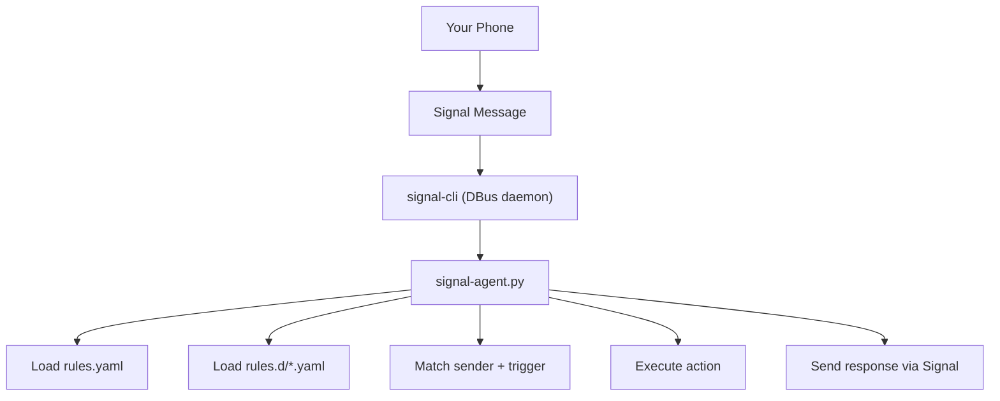

# Signal CLI Agent

Signal CLI Agent is a **rule-driven automation engine** that connects to `signal-cli` via DBus and executes **local actions** in response to **trusted** Signal messages.

It lets you securely trigger commands on a host using Signal as the control channel — without exposing SSH, a web server, or a public API.

For the full rule schema and configuration reference, see:

👉 **[docs/RULES.md](docs/RULES.md)**

---

## Table of Contents

- [Overview](#overview)
- [Why Use This?](#why-use-this)
- [Architecture](#architecture)
- [Plugin Architecture](#plugin-architecture)
- [Installation](#installation)
  - [Prerequisites](#prerequisites)
  - [Quick Start (Recommended)](#quick-start-recommended)
  - [Boot-Time Startup (Optional)](#boot-time-startup-optional)
- [Writing Rules](#writing-rules)
- [Operating Modes](#operating-modes)
  - [Service Mode (Recommended)](#service-mode-recommended)
  - [Manual Mode](#manual-mode)
  - [Test Mode](#test-mode)
- [Maintenance](#maintenance)
  - [Uninstall Services](#uninstall-services)
  - [Remove Generated Files](#remove-generated-files)
- [FAQ](#faq)
- [Roadmap](#roadmap)
- [Security Notes](#security-notes)

---

## Overview

Signal CLI Agent:

- Listens for incoming Signal messages (via DBus)
- Loads rules from YAML files
- Matches messages against sender + trigger conditions
- Executes an action (command or plugin)
- Sends results back via Signal

Rules are defined in YAML files and can be extended without modifying the agent code.

**Rule reference (required reading for anything beyond basics):**  
👉 **[docs/RULES.md](docs/RULES.md)**

---

## Why Use This?

Instead of exposing:

- SSH access
- a web server
- a public API

…you can use Signal as a secure, authenticated automation interface.

Common use cases:

- System diagnostics (“disk?”, “uptime?”)
- Log inspection (“tail journal 50”)
- Service health checks
- Lightweight automation for trusted contacts
- API status queries (Home Assistant / monitoring / internal tools)

---

## Architecture



---

## Plugin Architecture

In addition to `command`-based rules, the agent supports **plugin-style rules** for structured integrations.

Why plugins?

- Avoid shelling out to helper scripts for common “API read” workflows
- Standardize request handling (timeouts, errors, formatting)
- Make rules easier to understand and safer by constraining what they can do

Example use cases:

**1) Read a Home Assistant sensor (HTTP GET):**

```yaml
- name: ha_temp
  sender: "+15551234567"
  trigger: "temp?"
  match: exact

  type: home_assistant
  home_assistant:
    action: get_state
    entity_id: sensor.example_temperature
    label: "Temperature"

  reply_mode: output
```

**2) Activate a Home Assistant scene (controlled HTTP POST):**

```yaml
- name: bedroom_on
  sender: "+15551234567"
  trigger: "bedroom on"
  match: exact

  type: home_assistant_service
  home_assistant_service:
    domain: scene
    service: turn_on
    entity_id: scene.bedroom_on
    label: "Bedroom"

  reply_mode: output
```

Notes:

- Plugins are performed **on-demand** per message (no persistent HTTP connection).
- Phase 0/1 focuses on **safe reads** and **constrained service calls** (explicit domain/service/entity_id).
- The full plugin schema and supported actions are documented in **[docs/PLUGINS.md](docs/PLUGINS.md)**.

---

## Installation

### Prerequisites

#### Install `signal-cli`

Official repository:  
https://github.com/AsamK/signal-cli

Official install docs:  
https://github.com/AsamK/signal-cli#installation

You must **register and verify** your Signal number with `signal-cli` before the agent can be used.

#### Install Python dependencies

```sh
pip install pydbus pyyaml
sudo apt install python3-gi
```

Requirements:

- Python 3.10+
- `pydbus`
- `PyYAML`
- `python3-gi` (GLib bindings)

---

### Quick Start (Recommended)

From the repository root:

```sh
make quickstart
```

This will:

1) Run `configure.py`  
2) Render configuration templates into your environment  
3) Install systemd **user** services  
4) Start both services (DBus daemon + agent)

Verify:

```sh
make status
make logs
```

---

### Boot-Time Startup (Optional)

Systemd **user** services normally start when you log in.

To allow them to start at boot and keep running after logout:

```sh
sudo loginctl enable-linger <your-username>
```

Check:

```sh
loginctl show-user <your-username> | grep Linger
```

---

## Writing Rules

### Where rules live

**Production rules** live in:

```text
rules.d/
```

You may add your own `.yaml` files there at any time.

### Templates vs production rules

This repo also ships **templates**, which get rendered into real files by `configure.py`:

- Shipped templates live under:
  ```text
  templates/
  ```
- Rendered outputs go into:
  ```text
  systemd/
  rules.d/
  ```

**Important behavior:**

- `configure.py` renders only the **shipped templates** under `templates/`.
- Your own custom rule files placed in `rules.d/` are treated as **user-owned** and are not deleted by project tooling.

For the full rule schema, supported fields, match modes, sender allowlists, safe patterns, reply formatting, and plugins:

👉 **[docs/RULES.md](docs/RULES.md)**

---

## Operating Modes

### Service Mode (Recommended)

One-command setup:

```sh
make quickstart
```

Common operations:

```sh
make status
make logs
make restart
make stop
```

---

### Manual Mode

Start the DBus daemon (session bus):

```sh
signal-cli -a +15551234567 daemon --dbus
```

Run the agent:

```sh
python3 signal-agent.py ./rules.yaml
```

---

### Test Mode

Simulate a message locally (no DBus, no Signal send):

```sh
python3 signal-agent.py ./rules.yaml \
  --test \
  --sender "+15551234567" \
  --message "disk?"
```

This prints what would be sent back (based on matching rules).

---

## Maintenance

### Uninstall Services

```sh
make uninstall
```

Removes installed systemd **user** units only.

### Remove Generated Files

```sh
make clean
```

Removes generated configuration and rendered shipped templates only.

Your custom rules in `rules.d/` remain untouched.

---

## FAQ

### Do I need to restart after editing rules?
No. Rules are automatically reloaded when files change.

### Can I allow multiple senders?
Yes. Use `sender:` as a list. See **[docs/RULES.md](docs/RULES.md)**.

### What if multiple rules match?
The agent executes the **first matching rule** and stops.

### Can I call APIs?
Yes:
- For custom APIs: call a helper script via `command:`
- For structured integrations: use a plugin rule type (see “Plugin Architecture” above)

Full examples are documented in **[docs/RULES.md](docs/RULES.md)**.

### Where should I store secrets (tokens, API keys)?
Do **not** commit secrets. Store them in protected files (e.g., `~/.config/...`) with `chmod 600`.

---

## Roadmap

Proposed ideas:

- Expand plugins (start with **read-only GET**, then optional **POST** actions with guardrails)
- Docker deployment option
- Role-based access control / authorization tiers
- Metrics and enhanced logging

---

## Security Notes

This system executes local actions triggered by Signal messages.

You should:

- Restrict allowed senders
- Prefer strict matching (`exact`) when possible
- Validate inputs carefully (especially regex capture groups)
- Use rate limiting
- Avoid committing secrets
- Run as a non-root user

For detailed configuration, safety guidance, and safe vs unsafe examples:

👉 **[docs/RULES.md](docs/RULES.md)**
