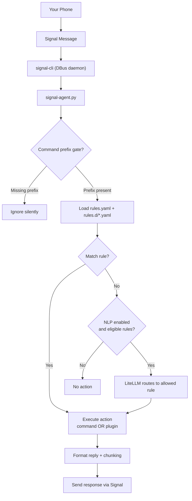

# Signal CLI Agent

[](https://github.com/jonhowe/signal-cli-agent/actions/workflows/docker-build-check.yml)
[](https://github.com/jonhowe/signal-cli-agent/actions/workflows/publish-ghcr.yml)

Signal CLI Agent is a **rule-driven automation engine** that connects to `signal-cli` via DBus and executes **local actions** in response to **trusted** Signal messages.

It lets you securely trigger actions on a host using Signal as the control channel — without exposing SSH, a web server, or a public API.

## Documentation

- **Rules / configuration (authoritative):** 👉 **[docs/RULES.md](docs/RULES.md)**
- **Example rules (walkthrough + samples):** 👉 **[docs/EXAMPLE_RULES.md](docs/EXAMPLE_RULES.md)**
- **Plugins (authoritative):** 👉 **[docs/PLUGINS.md](docs/PLUGINS.md)**
- **Docker details / troubleshooting:** 👉 **[docs/DOCKER.md](docs/DOCKER.md)**
- **External REST API (optional outbound sends):** 👉 **[docs/REST_API.md](docs/REST_API.md)**
- **Optional NLP routing (LiteLLM integration):** 👉 **[docs/NLP.md](docs/NLP.md)**
- **Non-container operation (systemd / bare-metal):** 👉 **[docs/NON_CONTAINER.md](docs/NON_CONTAINER.md)**
- **Development / building locally:** 👉 **[docs/DEVELOPMENT.md](docs/DEVELOPMENT.md)**
- **Dependencies and setup:** 👉 **[docs/DEPENDENCIES.md](docs/DEPENDENCIES.md)**

---

## Container Image

A prebuilt container image is published to GitHub Container Registry (GHCR):

- `ghcr.io/jonhowe/signal-cli-agent:latest`

---

# Quick Start (Docker Compose + GHCR Image)

This is the recommended flow:

1) clone the repo  
2) create `config/` and `data/`  
3) optionally add `docker-compose.override.yml`  
4) **pull/configure → link → sync → start**

### Prerequisites

- Docker + Docker Compose v2 (`docker compose ...`)
- Linux is recommended (this compose uses `network_mode: host`). For Docker Desktop (Mac/Windows), see **[docs/DOCKER.md](docs/DOCKER.md)**.

---

## 1) Clone the repo and create runtime directories

From the repo root:

```bash
git clone https://github.com/jonhowe/signal-cli-agent.git
cd signal-cli-agent
mkdir -p config data
```

---

## 2) Use the included `docker-compose.yml`

The repo now ships a ready-to-use [docker-compose.yml](/home/jhowe/git/signal-cli-agent/docker-compose.yml) in the root. It points at the published GHCR image and also includes a local `build:` definition for development workflows.

If you want local-only changes, create `docker-compose.override.yml` next to it. Docker Compose loads that file automatically.

Start from the provided example:

```bash
cp docker-compose.override.yml.example docker-compose.override.yml
```

The example file is fully commented. Uncomment only the settings you want to change locally.

Common override uses:

- set `SIGNAL_ACCOUNT` for multi-account DBus mode
- pin to a specific image tag instead of `:latest`
- switch to local rebuilds while developing

See **[docs/DOCKER.md](docs/DOCKER.md)** for an override example.

---

## 3) Pull the image

```bash
docker compose pull
```

---

## 4) Generate config (`./config`)

This renders `rules.yaml` and rule templates into `./config/`.

```bash
PHONE="+1XXXXXXXXXX"
docker compose run --rm signal-agent \
  python3 /app/configure.py --mode container --config-dir /config --phone "$PHONE"
```

After this step, you should see:

- `./config/rules.yaml`
- `./config/rules.d/…`

If you want a guided walkthrough of what the generated rules look like and how to customize them, see: **[docs/EXAMPLE_RULES.md](docs/EXAMPLE_RULES.md)**.

---

## 5) Link the Signal device (scan QR)

This prints an ASCII QR code in your terminal:

```bash
docker compose run --rm signal-agent link
```

To link:

1. Open **Signal** on your primary mobile device.
2. Go to **Settings → Linked Devices**.
3. Tap **Link New Device**.
4. Scan the QR code displayed in the terminal.
5. Wait for confirmation.

**Important:** the linked-device state is persisted under `./data/signal-cli`. Keep that directory if you don’t want to re-link.

---

## 6) Sync once

```bash
docker compose run --rm signal-agent sync
```

---

## 7) Start the long-running service

```bash
docker compose up -d
```

---

## 8) Tail logs

```bash
docker compose logs -f --no-color signal-agent
```

Stop everything:

```bash
docker compose down
```

Upgrade to the latest image later:

```bash
docker compose pull
docker compose up -d
```

---

# Directory Layout

When running in Docker mode, you’ll typically have:

- `./docker-compose.yml`  
  The repo-provided compose definition. `docker compose` reads this automatically.

- `./docker-compose.override.yml`  
  Optional local-only overrides. This file is auto-loaded if present and is gitignored.

- `./config/` → mounted to `/config`  
  User configuration and secrets:
  - `rules.yaml`
  - `rules.d/*.yaml`
  - token files (if you enable plugins like Home Assistant / REST API / NLP)

- `./data/` → mounted to `/data`  
  Persistent runtime state:
  - `signal-cli` linked device state (keep this directory to avoid re-linking)

**Note:** Application code (`signal-agent.py`, `plugins/`, `scripts/`) lives inside the container image under `/app`. You do not need to copy those into `./config`.

---

# Architecture



---

# Command Prefix Gate

To prevent accidental triggers (especially if NLP routing is enabled), you can require a prefix on **all commands**.

Set this in `config/rules.yaml` under `globals`:

```yaml
globals:
  command_prefix: "!"
  command_prefix_strip_whitespace: true
```

Then users must send:

```
! bedroom on
! can you turn on the bedroom lights?
```

The prefix is stripped **before** rule matching and **before** NLP routing.

---

# Plugins

In addition to `command`-based rules, the agent supports structured plugin rules (e.g., HTTP, Home Assistant, REST API, NLP routing).

Full documentation: **[docs/PLUGINS.md](docs/PLUGINS.md)**  
Example rule walkthroughs: **[docs/EXAMPLE_RULES.md](docs/EXAMPLE_RULES.md)**

---

# Security Notes

This system executes local actions triggered by Signal messages. You should:

- Restrict allowed senders
- Prefer strict matching (`exact`) when possible
- Validate inputs carefully (especially regex capture groups)
- Use rate limiting
- Avoid committing secrets (tokens, keys) into Git
- Run as a non-root user where feasible (depending on deployment)

For detailed configuration, safety guidance, and safe vs unsafe examples:

👉 **[docs/RULES.md](docs/RULES.md)**
