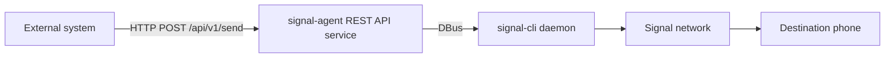

# Signal CLI Agent — External REST API

This document describes the optional **REST API service** that can send Signal messages.

The REST API is implemented as a **service plugin** (`rest_api`) that runs alongside the
main agent process.

It is designed for cases where you want external systems (CI, monitoring, home lab tools)
to notify you via Signal **without** exposing Signal itself to those systems.

---

## What it does

When enabled, the agent starts an HTTP server and exposes:

- `GET /health`
- `POST /api/v1/send`

`POST /api/v1/send` accepts JSON and triggers an outbound Signal send.



---

## Security model

This API is intentionally **locked down**. Recommended defaults:

1) Bind to localhost (`127.0.0.1`) and put TLS/auth in front of it (reverse proxy), or only call it locally.
2) Require a **Bearer token** (read from a local file).
3) Require an explicit **destination allowlist** (`allowed_destinations`).
4) Apply a simple **rate limit**.

### Controls

| Control | Where | Purpose |
|---|---|---|
| Bearer token auth | `rest_api.token_file` | Prevents unauthenticated use |
| Token file permissions | `rest_api.require_private_token_file` | Prevents accidental secret leakage (expects `chmod 600`) |
| Destination allowlist | `rest_api.allowed_destinations` | Prevents sending to arbitrary numbers |
| Client IP allowlist (optional) | `rest_api.allowed_client_ips` | Additional defense if bound beyond localhost |
| Request size limit | `rest_api.max_request_bytes` | Prevents huge POST bodies |
| Message length limit | `rest_api.max_message_chars` | Prevents very large sends |
| Rate limit | `rest_api.max_requests_per_minute` | Limits abuse / runaway callers |

---

## Configuration

Add this under `globals:` in `rules.yaml` (or set it in `rules.yaml.in` and re-run `configure.py`).

```yaml
globals:
  rest_api:
    enabled: false

    # Strongly recommended: only bind to localhost.
    bind_host: "127.0.0.1"
    bind_port: 8787

    # File containing the Bearer token. Recommended permissions: chmod 600
    token_file: "~/.config/signal-cli-agent/rest_api_token"
    require_private_token_file: true

    # REQUIRED for safety: only allow sending to these destinations.
    # Must be E.164 formatted numbers.
    allowed_destinations:
      - "+15551234567"

    # Optional additional gate.
    # If empty: allow any client IP that can reach bind_host:bind_port.
    allowed_client_ips: ["127.0.0.1"]

    # Request / message safety caps
    max_request_bytes: 32768
    max_message_chars: 3500
    max_recipients_per_request: 1

    # Optional chunking
    split_long_messages: true
    chunk_size: 1400
    numbered_chunks: true

    # Rate limiting (0 disables)
    max_requests_per_minute: 60
```

### Token file

Create a token file and lock it down:

```sh
mkdir -p ~/.config/signal-cli-agent
openssl rand -hex 32 > ~/.config/signal-cli-agent/rest_api_token
chmod 600 ~/.config/signal-cli-agent/rest_api_token
```

---

## Usage

Example with `curl`:

```sh
TOKEN="$(cat ~/.config/signal-cli-agent/rest_api_token)"

curl -sS -X POST "http://127.0.0.1:8787/api/v1/send" \
  -H "Authorization: Bearer ${TOKEN}" \
  -H "Content-Type: application/json" \
  -d '{"to": "+15551234567", "message": "hello from REST"}'
```

Successful response:

```json
{"status":"ok","recipients":["+15551234567"],"parts":1,"messages_sent":1,"dry_run":false}
```

---

## Operational notes

- Configuration is read at agent startup. If you change the REST API config, restart the agent.
- If you rotate the token file contents, the REST API will pick it up automatically (it reloads the token file when it changes).
- If you want TLS, put a reverse proxy (nginx/Caddy) in front of it and keep the agent bound to localhost.
